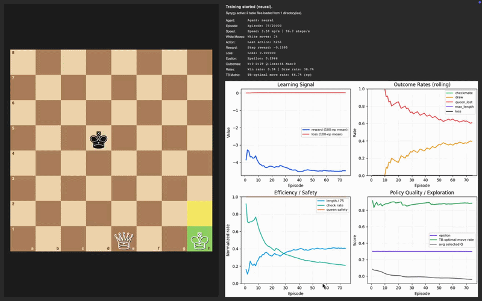
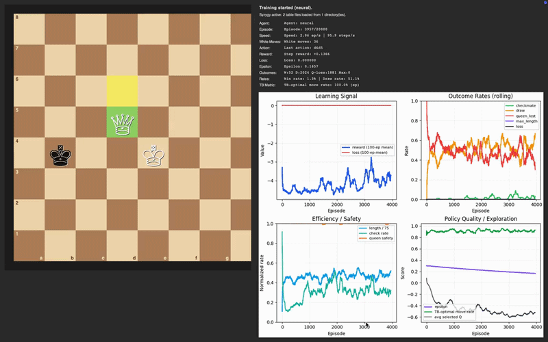

# Chess RL Endgames: Neural KQ vs K

<p align="center">
  
</p>

Neural reinforcement learning in a solved chess endgame: **King + Queen vs King (KQK)**.

This project trains a Q-learning style neural agent to convert winning KQK positions into checkmate, while exposing training dynamics in a live GUI (board + metrics + outcomes).

At the beginning of training, the agent is mostly exploratory and unstable: outcomes are noisy, checkmate frequency is low, and reward curves are dominated by tactical mistakes and draw cycles.

## Why?

Most chess RL projects jump directly to full-board self-play and very large models.
This project intentionally takes a controlled route:

- Uses a **small solved domain** (KQK) so behavior is measurable.
- Uses **structured features** instead of raw board pixels.
- Uses **explicit reward shaping** tied to endgame geometry.
- Compares behavior against optional **Syzygy tablebase** signals.

The result is a system that is easier to interpret, analyze, and improve methodically.

## Core Capabilities

- Train a neural agent in a live dashboard with board animation.
- Run headless experiments and log CSV artifacts.
- Evaluate against heuristic, random, or Syzygy-based defenders.
- Track win/draw/queen-loss trends and policy quality over time.

## Tech Stack

- [Python](https://www.python.org/)
- [python-chess](https://python-chess.readthedocs.io/)
- [PyTorch](https://pytorch.org/)
- [Matplotlib](https://matplotlib.org/)
- [Syzygy tablebases](https://syzygy-tables.info/) (optional)

## Installation

From repository root:

```bash
python3 -m venv .venv
source .venv/bin/activate
pip install -e ".[dev,analysis,rl]"
```

## Quick Start

Run live training dashboard:

```bash
PYTHONPATH=src python3 scripts/kqk_neural.py \
  --mode live \
  --episodes 20000 \
  --defender heuristic \
  --board-size 780
```

Run headless train + eval:

```bash
PYTHONPATH=src python3 scripts/kqk_neural.py \
  --mode train-eval \
  --episodes 20000 \
  --eval-episodes 2000 \
  --defender heuristic \
  --eval-defender heuristic
```

Evaluate an existing model only:

```bash
PYTHONPATH=src python3 scripts/kqk_neural.py \
  --mode eval \
  --eval-episodes 2000 \
  --eval-defender heuristic
```

## CLI Modes

- `live`: train with GUI.
- `train`: train headless, save model + log.
- `eval`: evaluate existing saved model.
- `train-eval`: train then evaluate.
- `live-eval`: live training then evaluation.

See all options:

```bash
PYTHONPATH=src python3 scripts/kqk_neural.py --help
```

## How Training Works

Each episode:

1. A legal KQK position is sampled (curriculum can bias easier starts first).
2. White (agent) chooses a move from legal actions.
3. Black (defender policy) replies.
4. Environment returns:
   - next abstract state
   - shaped reward
   - done flag (`checkmate`, `draw`, `queen_lost`, etc.)
5. Agent stores transition in replay buffer and periodically updates Q-network.

### State and Action Encoding

The model does not see raw board images. It sees engineered features:

- State: king distance, queen distance, edge/corner pressure, opposition flags, mobility bucket.
- Action: move type (king/queen), from/to coordinates, move vector, check flag, capture flag.

This keeps learning interpretable and lightweight.

### Reward Design (Current)

The environment encourages fast, safe mating patterns:

- `+10` checkmate + speed bonus
- `-2` draw
- `-3` queen loss
- `-0.02` per step
- positive shaping for reducing black mobility and forcing king toward edge/corner
- stall penalty for no progress streaks

## Understanding the Dashboard

- **Learning Signal**:
  - reward rolling mean
  - loss rolling mean
- **Outcome Rates**:
  - checkmate
  - draw
  - queen_lost
  - max_length
  - loss
- **Efficiency / Safety**:
  - episode length
  - check frequency
  - queen safety
- **Policy Quality / Exploration**:
  - epsilon
  - average selected Q
  - optional TB-optimal move rate when Syzygy is available

## Why Neural Results Can Look Bad Early

If you see low checkmate rates and high draw/queen-loss , this is usually expected in early-to-mid training and comes from a few concrete factors:

1. Exploration is still high.
At ~2000 episodes with default schedule, epsilon is often still around `0.20+`, so many random tactical blunders are still injected.

1. Heuristic defender is non-trivial.
The black defender actively seeks safer king geometry, making random/imperfect white play collapse into draws or queen losses.

1. Most transitions are negative before mating is discovered.
Per-step penalties + draw penalties dominate until agent reliably builds mating nets, so mean reward stays negative for a while.

1. Low loss does not guarantee good policy.
A small TD loss can mean the model is fitting a mediocre fixed point (predicting similarly bad values), not that it found high-quality play.

## Mid-Training Snapshot

<p align="center">
  
</p>

By mid training, exploration has reduced and policy behavior becomes more structured. You should typically see fewer immediate blunders, better queen safety, and a clearer trend in rolling outcome metrics. This phase is where the agent transitions from "survival + random checks" to consistent king-confinement behavior.

## Practical Hyperparameter Tips

If neural convergence is too slow, start here:

```bash
PYTHONPATH=src python3 scripts/kqk_neural.py \
  --mode train-eval \
  --episodes 40000 \
  --eval-episodes 4000 \
  --defender heuristic \
  --eval-defender heuristic \
  --epsilon 0.15 \
  --epsilon-decay 0.9995 \
  --gamma 0.92 \
  --batch-size 32 \
  --warmup-steps 256 \
  --train-interval 4 \
  --updates-per-step 2
```

Interpretation goal:
- queen losses should trend down first
- then draw rate should drop
- then checkmate rate should rise

## Syzygy Setup (Optional, Recommended)

Syzygy is optional. If missing, code has fallback.

Download minimal KQK files:

```bash
mkdir -p ~/syzygy
cd ~/syzygy
curl -LO https://tablebase.lichess.ovh/tables/standard/3-4-5-wdl/KQvK.rtbw
curl -LO https://tablebase.lichess.ovh/tables/standard/3-4-5-dtz/KQvK.rtbz
```

Run with Syzygy defender:

```bash
PYTHONPATH=src python3 scripts/kqk_neural.py \
  --mode train-eval \
  --defender syzygy \
  --eval-defender syzygy \
  --syzygy-path ~/syzygy
```

Note:
- `--require-syzygy` currently emits a warning when Syzygy is not loaded; it does not hard-fail.

## Running Tests

```bash
PYTHONPATH=src pytest -q
```
